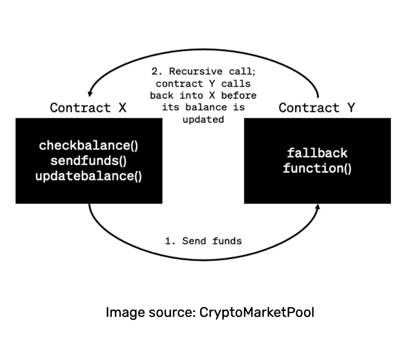
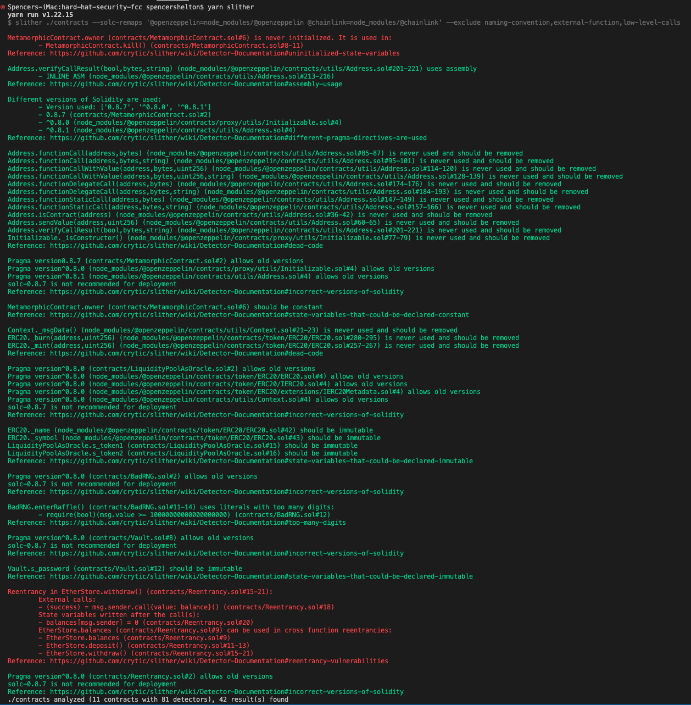
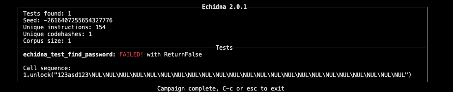

# Smart contract Security

## **Audits**
- an audit is a secuity focused code review looking for issues with your code.

## **Help you auditors**
Auditors are not looking for bugs or issues with the codes buisness logic, remember they are human to. The more info you can give them the better they can audit ur code for any **SEURITY ISSUES**

[Tweet from legendary secuity expert Tincho](https://twitter.com/tinchoabbate/status/1400170232904400897)

[Openzeppelin audit readiness guide](https://learn.openzeppelin.com/security-audits/readiness-guide)

- add comments
    - this will help your auditors understand what you're doing.
- Use [natspec](https://docs.soliditylang.org/en/v0.8.11/natspec-format.html)
    -   Document your functions. DOCUMENT YOUR FUNCTIONS.
-   Test
    -   If you don't have tests, and test coverage of all your functions and lines of code, you shouldn't go to audit. If your tests don't pass, don't go to audit.
-   Be ready to talk to your auditors
    -   The more communication, the better.
-   Be prepared to give them plenty of time.
    -   They literally pour themselves over your code.

> "At this time, there are 0 good auditors that can get you an audit in under a week. If an auditor says they can do it in that time frame, they are either doing you a favor or they are shit. " - Patrick Collins, March 4th, 2022s

## **Process of an audit**

An auditors process looks like this:

1. Run tests
2. Read specs/docs
3. Run fast tools (like slither, linters, static analysis, etc)
    - statick analysis: process of running some program to read over your code to find comman bugs
4. Manual Analysis
5. Run slow tools (like echidna, manticore, symbolic execution, MythX)
6. Discuss (and repeat steps as needed)
7. Write report ([Example report](https://github.com/transmissions11/solmate/tree/main/audits))

## **Most Common Attacks**
- Reentrancy attack
    - Reentrancy attacks occur when a smart contract function temporarily gives up control flow of the transaction by making an external call to a contract that is sometimes written by unknown or possibly hostile actors. This permits the latter contract to make a recursive call back to the primary smart contract function to drain its funds.
- Oracle Manipulation
    - A vulnerability arises when protocols relying on oracles automatically execute actions even though the oracle-provided data feed is incorrect. An oracle with deprecated or even malicious contents can have disastrous effects on all processes connected to the data feed. In practice, manipulated data feeds can cause significant damage, from unwarranted liquidations to malicious arbitrage trades. [Source](https://consensys.github.io/smart-contract-best-practices/attacks/oracle-manipulation/)

## **How Does a reentrancy attack work**
A reentrancy attack creates a recursive process that transfers funds between two smart contracts, the vulnerable contract and the malicious contract. Here are the steps of a reentrancy attack:

1) The bad actor makes a call on the vulnerable contract, "X," to transfer funds to the malicious contract, "Y."
2) Contract X determines whether the attacker has the necessary funds, then proceeds to transfer the funds to contract Y.
3) Once contract Y receives the funds, it executes a callback function which calls back into contract X before the balance is updated.
4) This recursive process continues until all funds have been exhausted and transferred.

The diagram below illustrates the attack scenario:
[Source](https://www.alchemy.com/overviews/reentrancy-attack-solidity#:~:text=Reentrancy%20attacks%20occur%20when%20a,unknown%20or%20possibly%20hostile%20actors.)
 

# Example Project
All contracts within this project have some type of vulnerablility.

## **BadRNG**
- this contact pics a random winner of raffle using block difficulty and message.sender.
    - this isnt truely random, as the miners can influence the block.difficulty

## **Liquidity Pool As Oracle** (Oracle Manipulation)
- in this example we are using a liquidity pool as an oracle
- minimalistic decentralized exchange example, where people can buy, sell and swap different assets.
- now using this singular exchange to get the swap price is a **TERRIBLE IDEA**
    - becuase this in a single protocol for a single price. The price from this protoocl is a single centralized location, and we don't want to get our price from a single centralized exchange. 
    - we want to get the price from many exchanges
    - getting a prize from any asset from a single decentrailized exchange is not **decentralized**
        - if somebody manipulates the market doing some crazy advanced defy things that will ruin the price of your assets.
        - SO dont get ur price from a centralized source.

## **Metamorphic Contract**
- This is used as a proxy
- the problem here is it's initializable and we dont guarantee that the contract has been initialized

## **Reentrancy Contract**
- this doesnt update balances before sending money which could have calling contract essentially drain all the money from this contract

```
    function withdraw() external {
        uint256 balance = balances[msg.sender];
        require(balance > 0);
        (bool success, ) = msg.sender.call{value: balance}("");
        require(success, "Failed to send Ether");
        balances[msg.sender] = 0;
    }
```

## **Vault**
- saves password on chain. NOT GOOD LOL 

# Slither
Slither is a solidity static analysis framework written in Python 3. It ruins a suite of vulnerablility detectors, prints visual information about contract details, and provides an API to easil write custom analyses. 

Slither enables developers to find vulnerablities, enchance their code comprehension, and quickly prototype custom analyses.

created by trail of bits, one of the best audit teams out there according to Patrick Collins

## **Set up**
1) make sure you have python installed
    - can check if you have it installed by typing `python3 --version` in teerminal
    - you should also have pip3 installed (usually comes with python)
2) install solc-select `pip3 install solc-select`
3) install slither-analyzer
    ```
     pip3 install slither-analyzer
    ```
4) You'll notice you now have a script for slither within package.json
    - youll know if it was installed correctly by running
```
 slither --help
```
5) run slither on contracts folder with
    - this runs the slither script you have within package.json
```
yarn slither
```
6) SIDE NOTES: solc and python must properly be installed on your device
    - one thing i messed up on was not fully installing python. Once python is installed you need to run the certificate script found in python folder
    - also solc needs to have the proper version installed and being used

## **Slither Response**

How to read response


- slither will list out a number of lines that contain issue then a reference to that issue
    - it will also be in red!
```diff
// current lines with issue
- MetamorphicContract.owner (contracts/MetamorphicContract.sol#6) is never initialized. It is used in:
        - MetamorphicContract.kill() (contracts/MetamorphicContract.sol#8-11)
// reference of issue
- Reference: https://github.com/crytic/slither/wiki/Detector-Documentation#uninitialized-state-variables
```
 - with the above issue its saying that metamorphic contract is never init so anyone could init it and become its owner

 The green text are just warnings or suggestions on how to make code better

 ``` diff
+ MetamorphicContract.owner (contracts/MetamorphicContract.sol#6) should be constant 
+ Reference: https://github.com/crytic/slither/wiki/Detector-Documentation#state-variables-that-could-be-declared-constant

 ```
 - here its telling us that owner could be a constant

 slither is a great tool but it may not find all the issues.

 # **Echidna tool** (for Manual Analysis)
trail of bits tool used to do fuzz testing.

**fuzz testing**: is an automated software testing technique that invloves providing invalid unexpected or random data as inputs to a computer program
 - alot of the times we will have people interacting with these contracts in ways we would have never expected

## Example Fuzztest
Fuzz tests are written in solidity unlike writing our tests in javascript.


So we built this vault contract and at first glance we expect the password should be private info. 
- although knowing smart contracts this is false at least how we wrote it.

```
contract VaultFuzzTest is Vault {
    constructor() Vault("123asd123") {}

    function echidna_test_find_password() public view returns (bool) {
        return s_locked == true;
    }
}
```

So we can test this with a test contract like so. We create a contract that is a Vault and add a function  to check if it is locked or not.  Which we can then send in a bunch of random data until that function returns false.

# Using ETH security toolbox
The eth security toolbox is basically a suit of all toold need to test security within a docker container.

* [Echidna](https://github.com/trailofbits/echidna) property-based fuzz tester
* [Etheno](https://github.com/trailofbits/etheno) integration tool and differential tester
* [Manticore](https://github.com/trailofbits/manticore) symbolic analyzer and formal contract verifier
* [Slither](https://github.com/trailofbits/slither) static analysis tool
* [Rattle](https://github.com/trailofbits/rattle) EVM lifter
* [Not So Smart Contracts](https://github.com/trailofbits/not-so-smart-contracts) repository

lets now create a docker container
- we already a script to run docker container
```
"toolbox": "docker run -it --rm -v $PWD:/src trailofbits/eth-security-toolbox",
```
we now have spun up a docker shell that will already have all of the above security tools installed

next our vaultFuzzTest.sol comes with a yaml file with all the correct config variables. used in echidna. to run echidna in our docker shell use
```
echidna-test /src/contracts/test/fuzzing/VaultFuzzTest.sol --contract VaultFuzzTest --config /src/contracts/test/fuzzing/config.yaml
```
response:


in the response its saying it found a usecase where it can make s_locked == false

and it found it with **"123asd123"**

